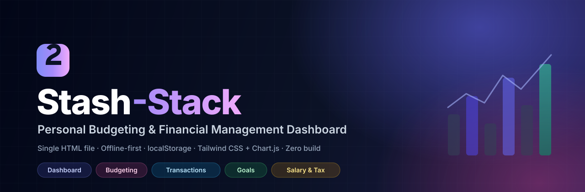

<div align="center">

# Stash-Stack

### Personal Budgeting &amp; Financial Management Dashboard

**🔗 Live app → [armand-vw.github.io/Stash-Stack](https://armand-vw.github.io/Stash-Stack/)**

[](https://armand-vw.github.io/Stash-Stack/)


[](LICENSE)

A modern, **offline-first** personal finance dashboard that lives in a **single HTML file**.
No build tools, no backend, no accounts — your financial data never leaves your browser.

</div>



---

## 🖥️ Live demo

**[https://armand-vw.github.io/Stash-Stack/](https://armand-vw.github.io/Stash-Stack/)**

Open the link on any device and start tracking. Your data is saved locally in that browser only —
use the built-in JSON export to back it up or move it between devices.

> **Privacy first:** the app has no server. Everything you enter is stored in your browser's
> `localStorage`. Other people visiting the link get their own blank copy and can only see their
> own data — never yours.

---

## ✨ Features

### 📊 Dashboard Overview
- KPI cards: **Total Income**, **Total Expenses**, **Net Cash Flow**, and **Savings Rate**
- **Expense breakdown** doughnut chart by category
- **Income vs. Expenses** trend bar chart (last 6 months)
- Month picker, recent transactions list, and quick-add actions

### 💰 Budgeting & Categories
- **50/30/20 rule** (Needs / Wants / Savings) or fully **custom** percentage allocations
- Create, edit and delete **expense & income categories** with monthly target limits
- Colour-coded progress bars: 🟢 under 80% · 🟡 80–100% · 🔴 over 100%
- Group roll-ups (Needs / Wants / Savings) against your baseline income

### 🧾 Transactions
- Add one-off or **recurring** (monthly / weekly) income and expense transactions
- Fields: date, category, type, amount, description, recurring flag
- **Search** by keyword, **filter** by type / category / month range, and **sort** by date or amount
- Edit and delete with confirmation; paginated table

### 🎯 Financial Goals
- Track goals like an **emergency fund**, house deposit, holiday or investment milestone
- Progress bars with **% complete**, remaining amount, required monthly contribution and **estimated completion date**
- **Deposit / Withdraw** funds, edit, and delete goals
- **Quick-allocate** this month's net savings straight into a goal

### 🧮 Salary & Income Calculator (gross → net)
- Enter gross income as **monthly or annual** and see the full breakdown to **net pay**
- Editable **progressive tax bands**, allowances, rebates and surcharges
- Payroll contributions (UIF, FICA, National Insurance, social security…) and custom deductions (pension, insurance, union fees…) with pre-tax support
- Effective and marginal tax rates
- One-click **“Set net as monthly budget baseline”**

#### Built-in tax presets (all fully editable)

| Currency | Region | Model |
|----------|--------|-------|
| **R — ZAR** (default) | 🇿🇦 South Africa | PAYE 2024/25 bands + primary rebate + UIF (1%, capped) |
| **$ — USD** | 🇺🇸 United States | Federal 2024 single-filer bands + standard deduction + FICA |
| **£ — GBP** | 🇬🇧 United Kingdom | Income Tax 2024/25 (PA £12,570; 20/40/45%) + employee National Insurance |
| **€ — EUR** | 🇧🇪 Belgium | 25/40/45/50% bands + allowance + employee social contributions + municipal surcharge |

### 💾 Data & UX
- **Auto-save** to `localStorage` on every change
- **Export** full state as **JSON**, or transactions as **CSV**
- **Import** a JSON backup to restore state
- **Load sample data** to explore instantly
- **Reset all** data with a typed confirmation
- **Dark / light** theme, **multi-currency** switcher, fully **responsive** (mobile → desktop)

---

## 🚀 Quick start

**Option A — Just use it**
Open the [live app](https://armand-vw.github.io/Stash-Stack/). Done.

**Option B — Run locally**
```bash
git clone https://github.com/armand-vw/Stash-Stack.git
cd Stash-Stack
# open index.html directly, or serve it:
python3 -m http.server 8000
# then visit http://localhost:8000
```

No `npm install`, no build step, no dependencies to manage — Tailwind CSS and Chart.js load from public CDNs.

---

## 🛠️ Tech stack

| Area | Choice |
|------|--------|
| UI | HTML5 + [Tailwind CSS](https://tailwindcss.com/) (Play CDN) |
| Charts | [Chart.js](https://www.chartjs.org/) 4 (CDN) |
| Logic | Vanilla JavaScript (ES2020+) |
| Storage | Browser `localStorage` (`stashstack.v1`) |
| Hosting | GitHub Pages |

---

## 🔐 Privacy

- **No backend, no analytics, no tracking.** The app never transmits your data anywhere.
- All figures are stored in your browser's `localStorage`, scoped to the browser/device you use.
- Because the repo is a static file, publishing it exposes the **code only** — never your data.
- Exported JSON/CSV files contain your data in plain text; keep them safe.
- Clearing site data will erase your figures — keep a JSON backup.

---

## 🗺️ Roadmap

- [x] Dashboard with KPIs and charts
- [x] Budgeting with 50/30/20 and custom rules
- [x] Transaction log with recurring entries and filters
- [x] Financial goals with contributions
- [x] Salary calculator with multi-country tax presets
- [x] JSON / CSV export &amp; import
- [ ] Optional passphrase encryption (AES-GCM) for stored data and backups
- [ ] Vendored (offline) libraries with subresource integrity
- [ ] PWA / installable app with offline caching
- [ ] Optional multi-device sync

---

## 🧾 Disclaimer

The tax presets are simplified estimates provided for planning convenience, are **not financial or
tax advice**, and may not reflect current legislation. Every value is editable inside the app —
verify with a qualified professional before relying on the numbers.

---

## 🤝 Contributing

This started as a personal project. Issues and pull requests are welcome — please keep changes
dependency-free and inside the single-file, zero-build philosophy.

If you find Stash-Stack useful, a ⭐ helps others discover it.

---

## 📄 License

Released under the [MIT License](LICENSE) © 2026 armand-vw.
